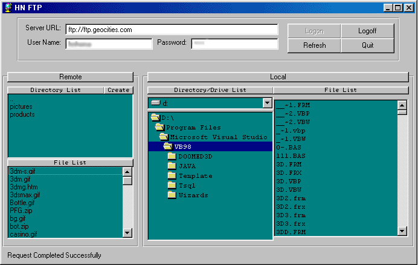



## HN EZ FTP Client

### Description

This is a FTP Client, which is based on drags and drops. You can download-upload any file by a simple drag-drop action. You can also manage directories and files in a remote computer. See the Screen Shot! Please vote and comment for this code. Thanks!
 
### More Info
 

             |
---                |---
**Submitted On**   |2001-08-09 06:51:24
**By**             |[Hesan Feghhi](https://github.com/Planet-Source-Code/PSCIndex/blob/master/ByAuthor/hesan-feghhi.md)
**Level**          |Advanced
**User Rating**    |3.3 (13 globes from 4 users)
**Compatibility**  |VB 5\.0, VB 6\.0
**Category**       |[Internet/ HTML](https://github.com/Planet-Source-Code/PSCIndex/blob/master/ByCategory/internet-html__1-34.md)
**World**          |[Visual Basic](https://github.com/Planet-Source-Code/PSCIndex/blob/master/ByWorld/visual-basic.md)
**Archive File**   |[HN EZ FTP 24309882001\.zip](https://github.com/Planet-Source-Code/hesan-feghhi-hn-ez-ftp-client__1-26007/archive/master.zip)

